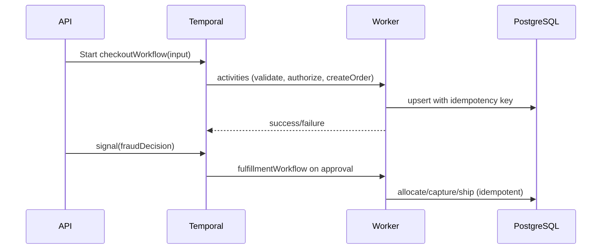

# ADR-002: Durable Workflows with Temporal (Checkout/Fulfillment/Returns)

**Status:** Accepted  
**Date:** 2025-10-02  
**Decision Makers:** Platform Architecture Team  
**Related ADRs:** ADR-007 (DB SoT), ADR-008 (Split), ADR-003 (Messaging)

---

## Context
Write paths need correctness under retries/timeouts, fraud holds, and long-running operations.

### Requirements
1. Deterministic workflow execution with retries/backoffs.
2. Clear separation of business state in DB vs workflow correlation in Temporal.
3. Signals for async gates (fraud, manual review).
4. Reconciliation job for stuck business entities.

## Decision
Adopt Temporal Cloud. Database is SoT; workflows store correlation IDs, not business state.

## Architecture

## Rationale
Temporal history + retry semantics reduce custom code; DB SoT prevents dual-state divergence.

## Implementation Details
- Retries: 200ms→30s, max 7; timeouts: 5–60s activities; workflow ≈15m.
- Signals for fraud; queries for snapshots.
- Reconciliation SQL scans for partial states then resume or alert.
- Determinism rules documented; CI checker.

## Metrics & SLOs
- Workflow failure <0.1% after retries.
- Mean reconciliation <5m.
- No duplicate charges/orders.

## Operations
- Versioned workflows; backfill/resume playbook.
- Cost alerts on workflow count & event volume.

## Security
- Worker credentials via Key Vault; PII not stored in payloads.

## Alternatives
- Azure Durable Functions; Custom orchestrator.

## Consequences
+ Reliable orchestration; − learning curve & cost.

## Success Metrics
E2E pass with simulated timeouts; reconciliation safe.
