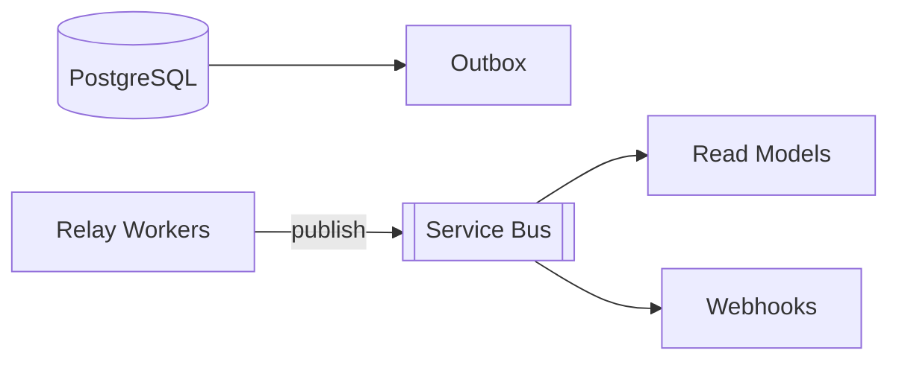

# ADR-003: Reliable Messaging: Outbox → Azure Service Bus

**Status:** Accepted  
**Date:** 2025-10-02  
**Decision Makers:** Platform Architecture Team  
**Related ADRs:** ADR-002, ADR-007, ADR-010

---

## Context
We publish events for read models, automations, and tenant webhooks with at-least-once semantics.

## Decision
Outbox table with relay to Azure Service Bus. Consumers idempotent; DLQ configured.

## Architecture

## Implementation Details
Schema with attempts/published_at; polling → LISTEN/NOTIFY → CDC phases.
Lag and events/sec metrics; phase triggers documented.
Consumers dedupe on event_id.

## Ops
Replay tool, DLQ quarantine, audit trail.

## Security
Tenant-scoped topics; minimal PII.

## Success Metrics
Zero lost events; lag within SLO.
